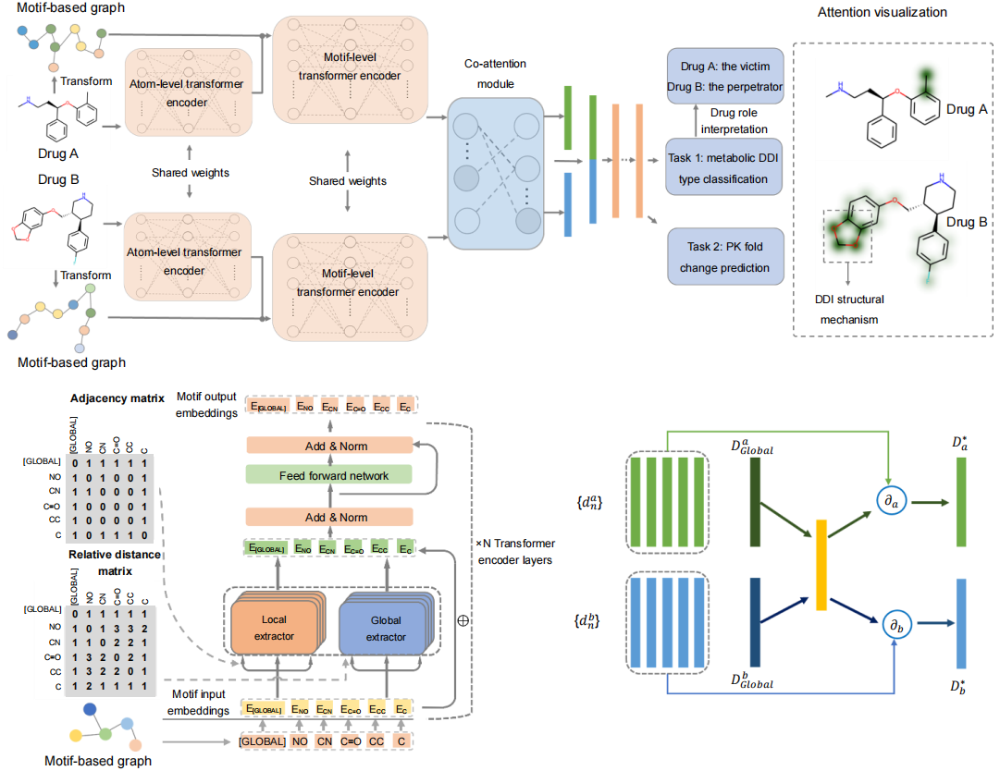

# Code for MeTDDI


This work is licensed under a
[Creative Commons Attribution-NonCommercial 4.0 International License][cc-by-nc].

[cc-by-nc]: http://creativecommons.org/licenses/by-nc/4.0/

-----------------------------------------------------------------
# Abstract

Unexpected drug-drug interactions (DDIs) are important issues for both pharmaceutical research and clinical
applications due to the high risk of causing severe adverse drug reactions (ADRs) or drug withdrawals. Many
deep learning models have achieved high performance in DDI prediction, but model interpretability to reveal
underlying causes of DDIs has not been extensively explored. Here, we propose MeTDDI, a deep learning
framework with local-global self-attention and co-attention to learn motif-based graphs for DDI prediction.
MeTDDI achieved competitive performance compared with the state-of-the-art models. Regarding
interpretability, we conducted extensive assessments on 73 drugs with 13,786 DDIs and MeTDDI can
precisely explain the structural mechanism for 5,602 DDIs covering 58 drugs. Besides, MeTDDI shows
potential to explain complex DDI mechanisms and mitigate DDI risks. To summarize, MeTDDI provides a
new perspective to explore DDI mechanisms, which will benefit both drug discovery and polypharmacy for
safer therapies for patients.



## 1. Requirements

To reproduce **MeTDDI**, the python==3.8,tensorflow-gpu==2.4.1 or ==2.5.0, ipython==8.7.0, matplotlib==3.6.2, pandas==1.5.2, rdkit-pypi==2022.9.3, scikit-learn==1.2.0 and network==2.8.8 are required.

## 2. Usage

### 2.1. Data

Data for model training and testing is available in the folder ``data/`` (e.g. ``/data/Classification/UnseenDDIs``) . The training, validaton and test dataset files start with the "tr_","val_" and "tst_".


### 2.2. Tasks 
#### 2.2.1 Classification
For training unseen DDIs:
```sh
    $ python -u Train_UnseenDDIs.py
```

For unseenDDI evaluation:
```sh
    $ python -u UnseenDDI_evaluate.py
```
For training unseen drugs:

```sh
    $ python -u Train_UnseenDrugs.py
```

For unseenDrugs evaluation:
```sh
    $ python -u UnseenDrugs_evaluate.py
```

#### 2.2.2 Regression
Using 
```sh
    $ python -u Train_MeTDDI_regression.py
```

for training and 
```sh
    $ python -u evaluation_regression.py
```

for evluation.

### 2.3. To reproduce Fig. 4.
To reproduce Fig. 4., using 
```sh
    $ python -u case_study.py
```
to generate the files of itraconazole_case_with_AUCFC.csv and paroxetine_case_with_AUCFC.csv in ``/data/Regression/Case_study`` based on the pretrained weights in ``/code/Regression/saved_weights/regression_fold.h5``

### 2.4. Train model with new DDI dataset
Follow the "preprocessing.ipynb" files and generate the "preprocessed_drug_info.npy" file required for model input. Then, replace the default dataset with your own and train model by running "Train_UnseenDDIs.py".

### 2.5. Visualization
To reproduce Fig. 3. and Supplementary Table 5 in the paper, use the ``/code/Visualization/MeTDDI_visualize.ipynb`` and follow the demos to obtain results. A user can also use the ``/code/Visualization/visualize_one_DDI_pair.ipynb`` for one DDI pair visualization. The weights for visualization is based on ``/code/Visualization/weights_for_intepretability.h5``.

# Drug role intepretation 
**Despite the DDI prediction, it is necessary to identify the perpetrators and victims (or roles) in DDI pairs. This helps drug researchers or clinicians understand the possible changes in the metabolism of co-prescribed drugs**. \

**Labels**:
label1: The metabolism of Drug 1 can be decreased when combined with Drug 2.\
label2: The metabolism of Drug 1 can be increased when combined with Drug 2.\
label3: The metabolism of Drug 2 can be decreased when combined with Drug 1.\
label4: The metabolism of Drug 2 can be increased when combined with Drug 1.\
Please note that label1 and label2 are the metabolic DDI descriptions in DrugBank (the semantic order), 
while label3 and label4 are the incorrect descriptions.\

**MeTDDI is sensitive to changes of the drug input order**.\

Using paroxetine and nevirapine as an example, we take drug_B as paroxetine and drug_A as nevirapine. \
If the predicted label for this pair is label1, we can interpret that paroxetine is the perpetrator in this DDI, 
while nevirapine is the victim, and paroxetine is responsible for the DDI via enzyme inhibition.\

If we change the input order (with nevirapine as drug_B and the perpetrator), the predicted result will be label3. \
This suggests that the input order is incorrect, and you need to change the input order. \
The same interpretation applies to label2 and label4.\

For more information, please check out ``/code/Visualization/visualize_one_DDI_pair.ipynb``.\

# Data and weights
Data and weights for MeTDDI can be downloaded from [here](http://www.wengzq-lab.cn/ddi/MeTDDI_downloads.php).

# Acknowledgements

The backbone implementation is referenced to [https://github.com/zhang-xuan1314/Molecular-graph-BERT](https://github.com/zhang-xuan1314/Molecular-graph-BERT).

# Citation

{
    
}

